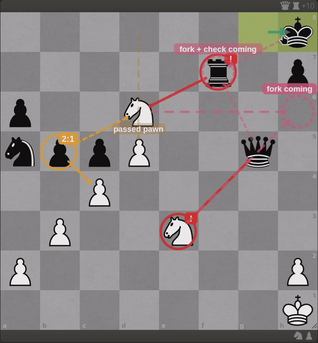
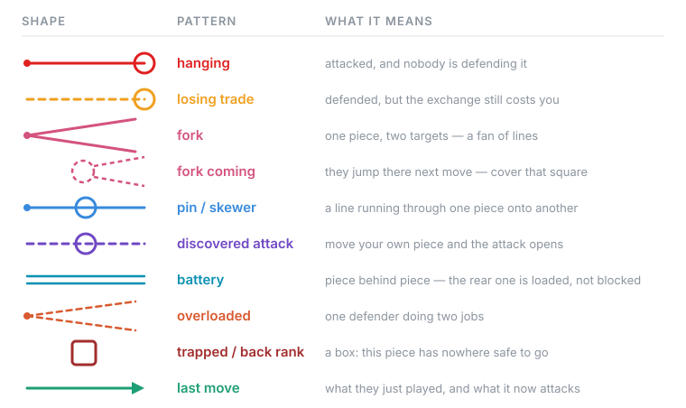

<div align="center">

# Chess Vision

**See the tactics you're missing — then stop needing to.**

A browser overlay for [lichess.org](https://lichess.org) that draws the tactical
patterns hiding in your position, and **fades each pattern away as you learn to
spot it yourself**.

No engine. No best-move hints. Nothing to install but the extension.

[](https://github.com/wiktorj137/chess-vision/actions/workflows/test.yml)
[](LICENSE)
[](CONTRIBUTING.md)

[Install](#install) · [How it works](#how-it-works) · [Contributing](CONTRIBUTING.md) · [Polski](README.pl.md)

</div>

<div align="center">
  
  <p><em>The overlay warns <strong>fork + check coming</strong> before the knight moves,<br>then draws the fork the moment it lands.</em></p>
</div>

---

## The problem

Beginners don't lose because they calculate badly. They lose because they
**never see the position**. The knight that forks in one move, the bishop
cutting the long diagonal, the pawn that is pinned and cannot actually capture —
all of it is right there on the board, and it is invisible until someone shows
it to you a few hundred times.

Engines don't fix this. An engine hands you a move and takes the seeing away.

## What Chess Vision does

It draws the relationships. Not coloured squares — **lines**, because a line has
direction and length, and that is what the eye remembers.

<div align="center">
  
</div>

Every pattern keeps **the same shape everywhere it occurs**. A fan of lines is
always a fork. A line running through a piece is always a pin. After a few dozen
repetitions the shape stops being a drawing and starts being a thing you notice.

## The part nobody else does

**It counts how often it has shown you each pattern, and then gets out of the way.**

| Times you've seen it | What gets drawn |
|---|---|
| first 40 | full line **and** the name of the pattern |
| 40–150 | thinner, dimmer line — **the name is gone** |
| 150+ | nothing at all, unless you ask for it with <kbd>p</kbd> |

Counting is per *occurrence*, not per position: a threat that stands for six
moves is one thing to learn, not six. Anything **forced** — a fork that comes
with check — keeps a faint mark forever, because a tactic the opponent cannot
avoid is never worth hiding.

The word is scaffolding for the shape, and the shape is scaffolding for the
habit. Both come down once they've done their job. The legend doubles as a
progress bar: you watch it retreat.

Success for this project is you turning it off and still seeing everything.

One button switches the fading off if you just want the overlay as a tool.

## What it detects

Hanging pieces · losing trades · **forks** · **forks one move before they happen**
· pins · absolute pins · skewers · discovered attacks · discovered checks ·
batteries · overloaded defenders · trapped pieces · back-rank weakness · passed
pawns · what the opponent's last move started attacking.

It also gets the awkward parts right:

- a **pinned piece cannot really capture**, so it doesn't count as an attacker
- a **queen behind a bishop is loaded, not blocked** — it counts as a second attacker
- a **king only defends until a second attacker arrives**, because it cannot recapture into check
- **anything with check jumps the queue**, because forced beats valuable

At most three patterns are drawn at once, ranked by material at stake, with one
slot always reserved for *your* opportunity. A board with eight overlapping
diagrams teaches nothing.

## Fair play — read this before you use it in a game

Chess Vision uses no engine and never suggests a move. It still draws things on
a live board, and lichess counts overlays as outside assistance.

| Where | Verdict |
|---|---|
| Analysis board, studies, puzzles | ✅ go ahead |
| Casual (unrated) games | ✅ fine — this is what it's built for |
| **Rated games** | ❌ **don't.** You risk your account. |

<kbd>v</kbd> turns the whole overlay off instantly.

## Install

Not on the Chrome Web Store yet — [help us get it there](CONTRIBUTING.md).

**Chrome / Edge / Brave**

1. Download this repo (`Code → Download ZIP`) and unzip it
2. Open `chrome://extensions` and turn on **Developer mode**
3. Click **Load unpacked** and pick the folder
4. Open lichess

**Firefox**

1. Open `about:debugging` → **This Firefox** → **Load Temporary Add-on**
2. Pick `manifest.json`

## Controls

| Key | Does |
|---|---|
| <kbd>v</kbd> | overlay on / off |
| <kbd>n</kbd> | pattern names on / off |
| <kbd>m</kbd> | how many patterns at once: 3 → 6 → all |
| <kbd>p</kbd> | show patterns you've already mastered |
| <kbd>d</kbd> | last move and its consequences |
| <kbd>Shift</kbd>+<kbd>V</kbd> | weak squares (off by default — noisy) |

The panel has a **language picker** — Auto, English, Polski — which switches
both the legend and the labels drawn on the board. Auto follows your browser.
[Adding a language](CONTRIBUTING.md#adding-a-language) is one object in one
file, no code.

## How it works

Three files, one job each:

| File | Job |
|---|---|
| `src/attacks.js` | pure chess logic, zero DOM — attack maps, pins, batteries, every pattern. This is the part with tests. |
| `src/board.js` | reads the position out of lichess' chessground DOM. The fragile bit: if lichess changes its markup, it breaks here and only here. |
| `src/content.js` | the SVG overlay, the wording, the learner mode. |

The overlay never touches lichess' own DOM. It appends one `<svg>` with
`pointer-events: none` on top, so clicking pieces still works.

```bash
npm test        # 55 tests, no dependencies, no build step
```

There is no build step and no framework. Clone it, edit a file, reload the
extension. `test/harness.html` is a fake chessground board for poking at the
rendering without opening lichess.

## Contributing

**This project is looking for help**, and a lot of the open work is small and
self-contained. Good places to start:

- **new patterns** — windmill, Greek gift, smothered mate, zwischenzug
- **languages** — one object in `src/content.js`, no code
- **the post-game recap** — an album of every pattern you met in a game
- **Chrome Web Store / AMO release** — packaging, screenshots, listing
- **better exchange evaluation** — the current one is a good heuristic, not full SEE

Read [CONTRIBUTING.md](CONTRIBUTING.md). Chess knowledge is as welcome as code:
if the overlay tells you something wrong, **open an issue with the FEN** and that
alone is a real contribution. Several of the sharpest bugs in this repo were
found exactly that way, by a player saying "hang on, that pawn is pinned".

## Roadmap

- [ ] post-game recap of every pattern you met
- [ ] settings panel instead of keyboard-only
- [ ] Chrome Web Store and Firefox Add-ons release
- [ ] castling and promotion in the last-move diff
- [ ] full static exchange evaluation
- [ ] more languages

## Credits

Built on the idea that a training aid should be trying to make itself obsolete.

Not affiliated with lichess.org. lichess is a wonderful free, open-source
project — [support them](https://lichess.org/patron).

## License

[MIT](LICENSE) — do what you like, just keep the notice.
